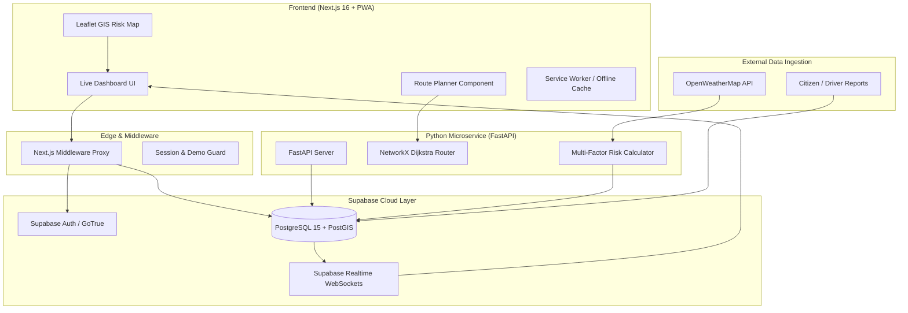

# 🌉 Setu — System Architecture & Technical Reference

> **Smart India Hackathon 2024**: Problem ID **SIH26002**  
> **Title**: AI-Based Smart Logistics and Accessibility Intelligence Platform for India's North Eastern Region (NER)  
> **Ministry**: Ministry of Development of North Eastern Region (MDoNER)  
> **Live Production App**: [https://frontend-ecru-seven-70.vercel.app](https://frontend-ecru-seven-70.vercel.app)  
> **Live Demo Dashboard**: [https://frontend-ecru-seven-70.vercel.app/dashboard?demo=true](https://frontend-ecru-seven-70.vercel.app/dashboard?demo=true)  
> **Pilot Geography**: East Khasi Hills District, Meghalaya (Shillong, Cherrapunji, Dawki, Mawsynram, Nongpoh)

---

## 📑 Contents
1. [Project Purpose & Problem Solved](#1-project-purpose--problem-solved)
2. [Layman's Guide & Standard Operating Procedures (SOPs)](#2-laymans-guide--standard-operating-procedures-sops)
3. [System Architecture](#3-system-architecture)
4. [Where Does the Data Come From?](#4-where-does-the-data-come-from)
5. [Codebase Map & Tech Stack](#5-codebase-map--tech-stack)
6. [Core Algorithms in the Code](#6-core-algorithms-in-the-code)
7. [Database Schema (10 Tables)](#7-database-schema-10-tables)
8. [Developer Setup & Gotchas](#8-developer-setup--gotchas)
9. [SIH Judge Q&A Defense](#9-sih-judge-qa-defense)

---

## 1. Project Purpose & Problem Solved

### The Real Problem in North East India
- **Terrain Vulnerability**: The North Eastern Region (NER) experiences the world's highest rainfall (>11,000 mm in Cherrapunji/Mawsynram) and steep terrain (>25° slopes).
- **Logistics Breakdown**: Monsoons cause recurring landslides, rockfalls, and road washaways. When single-artery national highways like NH-6 cut off, essential medicine and food convoys get stranded.
- **Why Google Maps Fails Here**: Google Maps optimizes for traffic speed on flat city roads. It does not know that a mountain road is on the verge of collapsing from 150 mm of rain, or that a deep valley has zero cellular signal.

### What Setu Does
Setu is a terrain-aware logistics intelligence platform that:
1. **Monitors 15 Arterial Corridors** across East Khasi Hills in real time with color-coded risk levels.
2. **Computes Safe Alternate Routes** using an AI Dijkstra graph algorithm that penalizes hazard corridors.
3. **Works in Zero-Signal Dead Zones** via an Offline-First Progressive Web App (PWA) with SMS fallback.
4. **Provides a Control Room Dashboard** for district authorities to monitor corridors and verify field reports.

---

## 2. Layman's Guide & Standard Operating Procedures (SOPs)

### 📖 The Layman Story: The Mountain Co-Pilot
> *Imagine driving a medicine truck to Cherrapunji in heavy rain. Google Maps says: "Take the shortcut, it's 10 minutes faster!" But Google Maps doesn't know that the 30° cliff above that shortcut is soaked with 100mm of rain and about to collapse. Setu acts like a mountain co-pilot: it checks the slope, the rainfall, and recent driver reports, turns the road RED, and guides you onto a safe bypass so you arrive alive.*

### 🔄 Layman Concept ⟷ Code Translation

| Layman Concept | What It Actually Means | Code / Implementation in This Repo |
|---|---|---|
| **Road Traffic Lights** | Roads colored Green, Yellow, or Red | GeoJSON polylines in [`RiskMap.tsx`](file:///z:/AntiGravity+Claude%20Code/AI-Based%20Smart%20Logistics%20&%20Accessibility%20Intelligence%20Platform/frontend/src/components/map/RiskMap.tsx) colored by `current_risk_score`. |
| **Smart Detour Finder** | Finds a safe route instead of a risky shortcut | Dijkstra algorithm in [`graph_router.py`](file:///z:/AntiGravity+Claude%20Code/AI-Based%20Smart%20Logistics%20&%20Accessibility%20Intelligence%20Platform/services/risk-engine/services/graph_router.py) with risk penalty. |
| **Works with No Internet** | App doesn't crash when phone signal drops | PWA Service Worker in `sw.js` and [`manifest.ts`](file:///z:/AntiGravity+Claude%20Code/AI-Based%20Smart%20Logistics%20&%20Accessibility%20Intelligence%20Platform/frontend/src/app/manifest.ts). |
| **Instant Screen Updates** | Map updates the second a landslide is reported | Supabase Realtime WebSocket in [`LiveDashboardView.tsx`](file:///z:/AntiGravity+Claude%20Code/AI-Based%20Smart%20Logistics%20&%20Accessibility%20Intelligence%20Platform/frontend/src/components/dashboard/LiveDashboardView.tsx). |
| **District Boundary** | Green outline around East Khasi Hills | PostGIS Polygon rendered in Leaflet map overlay. |

---

### 📋 SOP 1: Driver / Field Reporter Journey
1. **Before Departure**: Open the app ➡️ tap **"🗺️ GIS Risk Map"** ➡️ verify corridor colors (Green = Safe, Amber = Caution, Red = Hazard).
2. **Safe Navigation**: Open **"AI Safe-Route Finder"** ➡️ select Start Hub (e.g. *Nongpoh Hub*) and Destination (e.g. *Cherrapunji*) ➡️ adjust Risk Tolerance (default 70%) ➡️ follow highlighted green safe route.
3. **Reporting a Blockage**: If a road is blocked, tap **"⚠️ Report Hazard"** ➡️ GPS auto-captures coordinates ➡️ select Hazard Type (*Landslide, Flood, Road Damage*) and Severity (1 to 5) ➡️ submit.
4. **Offline Handling**: If there is no mobile data, the report queues locally in the phone. Once signal returns, it auto-syncs. Alternatively, tap **"Send via SMS"** for instant 160-char text dispatch.

---

### 🏛️ SOP 2: Control Room / Official Journey
1. **Morning Briefing**: Open the dashboard (`/dashboard`) ➡️ check KPI cards: 15 monitored corridors, high-hazard zones, and active weather feeds.
2. **Triage Alerts**: When a field report or heavy rain (>20 mm/hr) triggers, the affected corridor pulses red on the live map.
3. **Verify Report**: Inspect photo proof and crowd quorum in the reports queue ➡️ click **"Verify"** to mark it as an official hazard.
4. **Automated Rerouting**: The system recalculates safe routes and pushes updated pathing to all active logistics drivers.

---

### 💻 SOP 3: Developer Operations (Run & Deploy)
1. **Setup**: Clone repo ➡️ copy `.env.example` to `frontend/.env.local` ➡️ fill Supabase URL and Anon Key.
2. **Database**: Open Supabase SQL Editor ➡️ run [`infra/supabase/full_schema_setup.sql`](file:///z:/AntiGravity+Claude%20Code/AI-Based%20Smart%20Logistics%20&%20Accessibility%20Intelligence%20Platform/infra/supabase/full_schema_setup.sql) (creates all 10 tables and 15 corridors).
3. **Run Frontend**: Inside `frontend/`, run `node node_modules/next/dist/bin/next dev` ➡️ open `http://localhost:3000`.
4. **Run Risk Engine**: Inside `services/risk-engine/`, run `uvicorn app.main:app --reload --port 8000`.
5. **Deploy**: Inside `frontend/`, run `npx vercel deploy --prod --yes` ➡️ live on Vercel production.

---

## 3. System Architecture



---

## 4. Where Does the Data Come From?

Every data point in this platform comes from a specific, implemented pipeline:

| Data Layer | Source in This Project | Implementation / Table |
|---|---|---|
| **Road Corridors** | OpenStreetMap (OSM) highway network for East Khasi Hills (NH-6, NH-206, SH-5) | Seeded into `road_segments` table via `full_schema_setup.sql` as PostGIS `LineString` geometries. |
| **Topography & Slopes** | Digital Elevation Model (DEM) data calculated into slope gradient degrees | Stored as `slope_gradient` (e.g. 28.0°) in `road_segments` table. |
| **Weather & Rainfall** | OpenWeatherMap API live endpoint polling | Fetched by `services/risk-engine/services/weather.py` and cached in `weather_cache` table. |
| **Historical Landslides** | Geological Survey of India (GSI) susceptibility logs | Seeded as baseline vulnerability scores in `risk_scores` table. |
| **Live Hazard Incidents** | Real-time driver and field reporter submissions | Saved in `reports` table with GPS points (`ST_Point`), verified in `report_verifications`. |

---

## 5. Codebase Map & Tech Stack

### Monorepo Structure
```
AI-Based Smart Logistics & Accessibility Intelligence Platform/
├── frontend/                                   # Next.js 16 Web Application
│   ├── src/
│   │   ├── app/
│   │   │   ├── (auth)/login/page.tsx           # Login with Password / OTP
│   │   │   ├── (auth)/signup/page.tsx          # Signup with role selector
│   │   │   ├── auth/signout/route.ts           # Signout handler (clears cookies)
│   │   │   ├── dashboard/page.tsx              # Server-rendered Dashboard shell
│   │   │   ├── layout.tsx                      # Root layout & meta tags
│   │   │   ├── manifest.ts                     # PWA manifest definition
│   │   │   └── page.tsx                        # Public landing page
│   │   ├── components/
│   │   │   ├── auth/LoginForm.tsx              # Auth forms & demo button
│   │   │   ├── auth/SignupForm.tsx             # Role registration (Driver/Official)
│   │   │   ├── dashboard/LiveDashboardView.tsx # Real-time dashboard view & telemetry
│   │   │   ├── map/DynamicRiskMap.tsx          # SSR-safe dynamic wrapper for Leaflet
│   │   │   ├── map/RiskMap.tsx                 # Leaflet map with 15 corridors & boundary
│   │   │   └── routing/RoutePlanner.tsx        # Hub selector, tolerance slider, comparison
│   │   ├── lib/
│   │   │   └── supabase/                       # client.ts, server.ts, middleware.ts
│   │   └── middleware.ts                       # Edge session refresh & route guards
│   └── package.json                            # Next.js 16, React 19, Leaflet 1.9
├── services/
│   └── risk-engine/                            # Python FastAPI Intelligence Service
│       ├── main.py                             # FastAPI app entry & CORS
│       ├── routers/
│       │   ├── health.py                       # /health check endpoint
│       │   ├── risk.py                         # /corridors & risk scores
│       │   └── routing.py                      # /routes/safe-route endpoint
│       └── services/
│           ├── graph_router.py                 # NetworkX Dijkstra Safe Routing
│           ├── risk_calculator.py              # Multi-factor RRI formula
│           └── weather.py                      # OpenWeatherMap client
└── infra/
    └── supabase/
        └── full_schema_setup.sql               # 10-table idempotent migration & seed
```

---

## 6. Core Algorithms in the Code

### 1. Road Risk Index (RRI) Formulation
Located in [`risk_calculator.py`](file:///z:/AntiGravity+Claude%20Code/AI-Based%20Smart%20Logistics%20&%20Accessibility%20Intelligence%20Platform/services/risk-engine/services/risk_calculator.py):

$$RRI = (0.25 \times \text{Slope}) + (0.35 \times \text{Rainfall}) + (0.20 \times \text{History}) + (0.20 \times \text{Reports})$$

- **Slope Factor**: Derived from `slope_gradient / 45.0` (slopes $>25^\circ$ increase score rapidly).
- **Rainfall Factor**: Derived from precipitation in mm/hr ($>20\text{ mm/hr}$ = heavy monsoon downpour).
- **History Factor**: Baseline GSI landslide frequency.
- **Reports Factor**: Number of verified active citizen hazard reports in the last 4 hours.
- **Risk Tiers**:
  - 🟢 **Green** ($RRI < 0.40$): Low risk, normal mountain transit.
  - 🟡 **Amber** ($0.40 \le RRI < 0.70$): Moderate risk, caution advised.
  - 🔴 **Red** ($RRI \ge 0.70$): Critical hazard, landslide or road washaway.

---

### 2. Risk-Weighted Dijkstra Safe Routing
Located in [`graph_router.py`](file:///z:/AntiGravity+Claude%20Code/AI-Based%20Smart%20Logistics%20&%20Accessibility%20Intelligence%20Platform/services/risk-engine/services/graph_router.py):

Standard routing uses distance: $\text{Weight} = \text{Distance}$.  
Setu's Safe Router penalizes risky corridors using:

$$\text{Edge Cost} = \text{Distance} \times \left(1.0 + \left(\frac{\text{Risk Score}}{1.0 - \text{Tolerance}}\right)^2\right)$$

- **How it works**: If a corridor's risk score approaches the user's selected **Risk Tolerance** (e.g. 70%), the denominator $(1 - \text{Tolerance})$ shrinks, causing the edge cost to spike dramatically. The Dijkstra algorithm naturally navigates around that segment to find a safer path.
- **Hubs Supported**: Nongpoh Hub, Umiam Junction, Shillong Center, Upper Shillong, Mawphlang Junction, Laitlyngkot Pass, Pynursla Outpost, Cherrapunji Terminus, Mawsynram Station, Dawki Border Port.

---

## 7. Database Schema (10 Tables)

Executed via [`infra/supabase/full_schema_setup.sql`](file:///z:/AntiGravity+Claude%20Code/AI-Based%20Smart%20Logistics%20&%20Accessibility%20Intelligence%20Platform/infra/supabase/full_schema_setup.sql):

1. **`districts`**: Administrative boundaries with PostGIS `ST_Polygon` (East Khasi Hills).
2. **`users`**: User profiles mapped to Supabase Auth UUIDs, roles (`official`, `driver`, `reporter`, `admin`).
3. **`road_segments`**: 15 arterial road corridors with PostGIS `ST_LineString`, highway code, length, slope gradient, and current risk score.
4. **`risk_scores`**: Historical and calculated risk logs per segment.
5. **`risk_alerts`**: Broadcast alerts with severity levels (`low`, `moderate`, `high`, `critical`).
6. **`reports`**: Field-submitted hazard reports with GPS `ST_Point`, hazard type, severity, and photo URL.
7. **`report_verifications`**: Verification audits by officials to prevent spam.
8. **`notifications`**: User-facing alert delivery records.
9. **`audit_logs`**: System audit trail tracking road closure overrides and updates.
10. **`weather_cache`**: Caches OpenWeatherMap responses to avoid rate limits.

---

## 8. Developer Setup & Gotchas

### Local Setup in 3 Commands
```bash
# 1. Install frontend dependencies
cd frontend && npm install

# 2. Run Next.js (use node directly to avoid Windows ampersand cmd bugs)
node node_modules/next/dist/bin/next dev

# 3. In another terminal, run FastAPI Risk Engine
cd ../services/risk-engine
python -m venv .venv && .venv/Scripts/activate
pip install -r requirements.txt
uvicorn app.main:app --reload --port 8000
```

### 3 Vital Gotchas to Remember
1. **Leaflet SSR Crash**: Leaflet requires `window`. Always use [`DynamicRiskMap.tsx`](file:///z:/AntiGravity+Claude%20Code/AI-Based%20Smart%20Logistics%20&%20Accessibility%20Intelligence%20Platform/frontend/src/components/map/DynamicRiskMap.tsx) with `next/dynamic({ ssr: false })`.
2. **Coordinate Order**: PostGIS uses `[Longitude, Latitude]`. Leaflet expects `[Latitude, Longitude]`. Always flip coordinates when rendering polylines.
3. **Demo Cookie vs Middleware**: In [`middleware.ts`](file:///z:/AntiGravity+Claude%20Code/AI-Based%20Smart%20Logistics%20&%20Accessibility%20Intelligence%20Platform/frontend/src/lib/supabase/middleware.ts), only genuine authenticated `user` sessions are redirected away from `/login`. Demo visitors are never blocked from accessing login/signup.

---

## 9. SIH Judge Q&A Defense

### Q1: *"Why can't drivers just use Google Maps?"*
**Answer**: Google Maps measures traffic speed via phones on the road. On a mountain highway in Meghalaya, an empty road shows green (clear) on Google Maps right until a truck drives into a freshly fallen landslide. Google Maps does not know the slope is 28° or that 50 mm of rain fell in the last hour. Setu predicts geotechnical risk before a disaster happens.

### Q2: *"How does it work when there is zero mobile signal in the hills?"*
**Answer**: Setu is a Progressive Web App (PWA) with Service Worker caching. The maps and routes remain functional offline. If a driver reports a hazard in a dead zone, the report is saved in their phone's local queue and auto-syncs when signal returns, or can be dispatched via 160-character emergency SMS.

### Q3: *"How do you prevent fake or spam hazard reports?"*
**Answer**: Reports require GPS location within 200m of the flagged road segment. Additionally, our control room features a verification queue where district officials review reports before they elevate a corridor's risk tier.

### Q4: *"Can this scale to other North Eastern states like Sikkim or Arunachal Pradesh?"*
**Answer**: Yes. The database architecture is built on PostGIS and the graph router is decoupled in FastAPI. Adding a new state simply requires uploading its road network GeoJSON and adding its district polygon.
