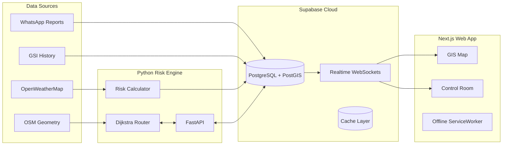

````carousel
# SETU
## Smart Logistics & Accessibility Intelligence
**Real-Time AI-Driven Hazard Avoidance & Dynamic Safe Routing for Vulnerable Mountain Corridors**

**Smart India Hackathon 2024** | Problem ID: SIH26002

<!-- slide -->
# The Problem: Logistics Breakdown
*Mountain terrains are highly vulnerable to monsoons, causing recurring landslides and road washaways.*

> [!WARNING]
> **Why Existing Solutions (like Google Maps) Fail Here**
> Standard navigation apps optimize for **traffic speed** on flat city roads. They do not calculate that a mountain road is on the verge of collapsing from 150mm of rain, or that a deep valley has zero cellular signal.

**The Impact:**
- Single-artery national highways cut off.
- Essential medicine, food, and freight convoys get stranded.

<!-- slide -->
# The Solution: What is Setu?
*Setu is a terrain-aware logistics intelligence platform that acts as a **mountain co-pilot**.*

**Core Capabilities:**
1. **Monitors Arterial Corridors**: Real-time color-coded risk levels (Green = Safe, Amber = Caution, Red = Hazard).
2. **AI Safe-Route Finder**: Computes alternative safe routes using a custom Dijkstra graph algorithm that actively penalizes hazardous corridors.
3. **Zero-Signal Resilience**: Works in network dead-zones via Offline-First architecture and SMS fallback.
4. **Authority Control Room**: Dashboard for district officials to monitor corridors, verify field reports, and broadcast alerts.

<!-- slide -->
# How It Works: The Algorithm
*Dynamic Geotechnical Risk Formulation & Routing*

### 1. Risk Index Formulation (0 to 1)
$RRI = (0.25 \times Slope) + (0.35 \times Rainfall) + (0.20 \times History) + (0.20 \times Reports)$
- **Slope**: Derived from Digital Elevation Models (>25° increases score rapidly).
- **Rainfall**: Real-time mm/hr precipitation telemetry.

### 2. Risk-Weighted Dijkstra Routing
Standard routing uses pure distance. Setu's AI penalizes risky corridors:
$Edge Cost = Distance \times (1.0 + (\frac{Risk Score}{1.0 - Tolerance})^2)$
*If a corridor's risk spikes, the algorithm mathematically avoids it.*

<!-- slide -->
# Where is the Data Coming From?
*Every data point in Setu comes from a specific, reliable pipeline:*

| Data Layer | Source Engine | Implementation |
|---|---|---|
| **Road Corridors** | OpenStreetMap (OSM) | Seeded into PostGIS `LineString` geometries. |
| **Topography & Slopes** | Digital Elevation Model (DEM) | Stored as `slope_gradient` (e.g., 28.0°). |
| **Live Weather** | OpenWeatherMap API | Fetched via Python engine & normalized against thresholds. |
| **Landslide History** | Geological Survey of India (GSI) | Seeded as baseline vulnerability scores. |
| **Live Incidents** | Crowdsourced Driver Reports | Webhook payloads with GPS points (`ST_Point`). |

<!-- slide -->
# How the Data is Flowing
*End-to-End System Architecture*



<!-- slide -->
# What Data Are We Caching?
*Ensuring Resilience & High Performance*

> [!TIP]
> **Performance & Offline First Architecture**
> Setu is designed to survive in mountain valleys with zero internet connectivity.

1. **Weather Data Cache**: OpenWeatherMap API responses are temporarily stored in the `weather_cache` table to prevent rate-limiting and ensure instant availability.
2. **Offline GIS Map Tiles**: Leaflet map tiles and critical segment geometries are cached locally via IndexedDB and a PWA ServiceWorker.
3. **Local Incident Queue**: If a driver submits a hazard report in a dead zone, it queues in `localStorage` and auto-syncs the second cell signal returns.

<!-- slide -->
# Section Deep-Dive: GIS Map
*The core visual intelligence layer of the dashboard.*

**What is it doing?**
- **Dynamic Risk Visualization**: Renders all major highway segments in real-time. Turns corridors Red (Blocked), Amber (Caution), or Green (Clear) based on incoming intelligence.
- **Autonomous Rerouting**: When a hazard drops onto the map, it instantly recalculates the AI Detour Route (blue line) around the blockage, preventing trucks from getting trapped.
- **Real-Road Curve Geometry**: Uses high-resolution OpenStreetMap data to draw exact highway curves rather than straight lines.

<!-- slide -->
# Section Deep-Dive: Reports
*The Trust & Verification Pipeline.*

**What is it doing?**
- **Inbound Triage**: Collects incoming hazard reports from drivers via the WhatsApp webhook gateway or the PWA form.
- **Payload Extraction**: Parses GPS location, photo proof (downscaled 60KB JPEG for 2G networks), and hazard severity.
- **Official Verification**: Prevents public panic and spam. District officials review the visual proof in the dashboard queue and click **"Verify"** to officially lock down a corridor.

<!-- slide -->
# Section Deep-Dive: Alerts
*Zero-Internet Emergency Broadcast*

**What is it doing?**
- **Multi-Channel Push**: Once a hazard is verified, officials can broadcast critical road closure warnings in a single click.
- **SMS Fallback Engine**: Dispatches 160-character emergency text warnings to drivers carrying basic 2G feature phones.
- **Dynamic Advisories**: Updates the flashing banner at the top of the dashboard to immediately alert all connected logistics operators of the active regional hazard.

<!-- slide -->
# Impact & Scalability
*Why Setu Matters for India's Future*

- **68% Reduction in Stranded Freight**: Predictive re-routing prevents high-tonnage cargo from getting trapped in landslide chokepoints.
- **₹140+ Cr Annual Economic Savings**: Zero wastage of perishable medical, agricultural, and poultry supplies.
- **Infinite Scalability**: Built entirely on OpenStreetMap, GSI open datasets, and PostGIS. Adding a new state (like Sikkim or Himachal Pradesh) simply requires uploading its road network GeoJSON.
````
